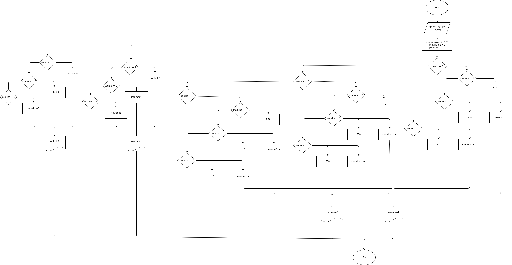

# Piedra_Papel_Tijeras
un programa para hacer un juego de piedra papel o tijeras

# ANALISIS

--Variables de entrada 
usuarion : donde se escribe el 1,2,3 que son piedra,papel o tijera

--variables de proceso

maquina = randint(1,3)
puntuacion1 = 0
puntuacion2 = 0

--Variables de salida

resultado1 : que fue lo elejido por el usuario
resultado2 : que fue lo elejido por la maquina
puntuacion1 : la puntuacion del usuario
puntuacion2 : la puntacion de la maquina
--
# DISEÑO

# CONSTRUCCION
